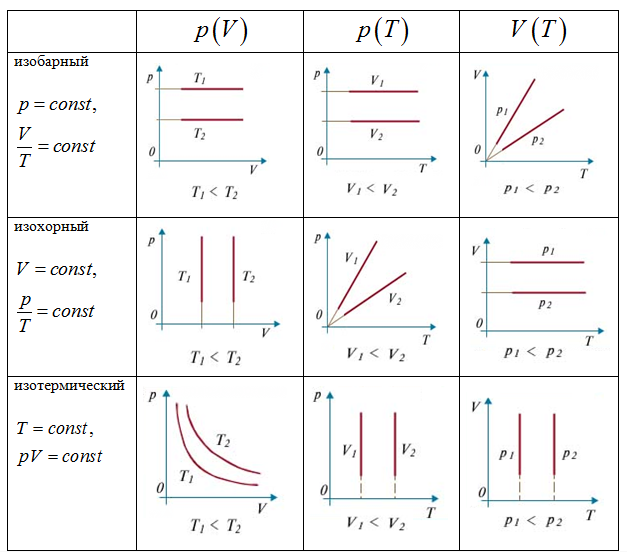

Состояние некоторой массы газа определяется заданием трех термодинамических параметров - давления **р**, объема **V**, и температуры **Т**. Связь между этими параметрами в общем виде можно выразить формулой F(p,V,T) = 0. Такое соотношение называется <u>уравнением состояния</u> системы (газа).  
  
Простейшими свойствами обладает <u>идеальный газ</u>, т.е. газ, взаимодействием между молекулами которого можно пренебречь Всякий достаточно разряженный газ близок к идеальному. Воздух, азот, кислород при обычных условиях (1 атм, комнатные температуры) мало отличаются от идеального газа. <u>Уравнение состояния идеального газа</u> может быть записано в виде уравнения Клайперона:

$$\frac{pV}{T}=const$$
  
**Закон Авогадро**: одинаковое количество молей любого газа при одинаковых условиях (температуре и давлении) занимают одинаковые объемы. В частности, при нормальных условиях ($Т_{o}$ = 0 °С, $р_{o}$ = 1 атм) объем одного моля равен $V_{м}$ = 22,4 л.  
  
Отсюда следует, что, если любого газа взять 1 моль, то величина константы в уравнении Клайперона будет одинакова для всех газов, Обозначим ее буквой **R** и назовем универсальной газовой постоянной:  

$$\frac{p_{o}V_{м}}{T_{o}}=\frac{1,013*10^{5}*0,0224}{273}=8,31\frac{Дж}{моль*К}=R$$

Перепишем последнее уравнение в виде: 

$$pV_{м}=RT$$
  
Умножим его на произвольное число молей ν:

$$pV_{М}ν=νRT$$

Учтем, что $V_{М}ν=V$, и $ν=\frac{m}{M}$ (где м - масса газа, а М - молярная масса), и получим уравнение Клайперона-Менделеева (уравнение состояния для произвольной массы газа): 

$$pV=\frac{m}{M}RT$$

Умножим и разделим правую часть уравнения Клапейрона-Менделеева на число Авогадро $N_{A}$: 

$$pV=νN_{A}\frac{R}{N_{A}}T$$ 
Произведение $νN_{A}$ дает нам общее число молекул **N**, а отношение $\frac{R}{N_{A}}$‚ является постоянной Больцмана **k**. Таким образом, имеем: 

$$pV=NkT$$
или  

$$p=\frac{N}{V}kT=nkt,$$

где **n** - концентрация частиц.
<u>Изопроцессами</u> называются термодинамические процессы, происходящие в системе при 
каком-либо одном постоянном параметре состояния.  

Пусть $p_{0}$ и $V_{0}$ - это давление и объем газа при 0 °С.

<u>Изотермический процесс</u> (**Т** = const): pV = const (закон Бойля-Мариотта).  
  
<u>Изохорический процесс</u> (**V** = const): $\frac{p}{T} = const$. Другая форма записи: $p=p_{0}(1+αt)$, где $α = \frac{1}{273,15} К^{-1}$ - термический коэффициент давления. Если в последнее уравнение вместо температуры по шкале Цельсия **t** подставить температуру по шкале Кельвина $t=T-273,15,$ то после преобразований получим: 

$$p=p_{0}αT$$

<u>Изобарический процесс</u> (р = const): $\frac{V}{T} = const$ (закон Гей-Люссака).  
  
Другая форма записи: $V = V_{0} (1 + αt)$, где $α = \frac{1}{273,15} К^{-1}$ - коэффициент объемного расширения. Если в последнее уравнение вместо температуры по шкале Цельсия **t** подставить температуру по шкале Кельвина $t=T-273,15,$  то после преобразований получим: 

$$V=V_{0}αT$$

Графики изопроцессов представлены на рисунке:

