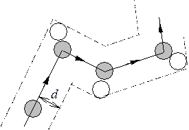

Минимальное расстояние. на которое сближаются центры двух молекул при столкновении называется **эффективным диаметром** молекулы **d**, а величина $σ=πd^{2}$ называется **эффективным сечением** молекулы.

**Средняя длина свободного пробега** молекулы - это прямолинейный участок пути, проходимый молекулой между двумя последовательными соударениями.

Пусть имеется газ с концентрацией **n**. Пусть движется только одна молекула, а остальные неподвижны. За 1 секунду эта молекула пройдет путь, равный ее средней скорости < v > ‚ и столкнется cо всеми молекулами, центры которых расположены в ломанном цилиндре длиной < v > и площадью основания, равному эффективному сечению (рисунок). Умножив объем цилиндра на концентрацию **n**, получим число столкновений: 
$$ν'=πd^{2}<v>n.$$
В действительности, движется не одна, а все молекулы, поэтому в последнюю формулу должна входить не средняя скорость относительно стенок сосуда, а скорость относительно других молекул. Можно доказать, что $< v_{отн} > = \sqrt2 < v >$. Таким образом, среднее число столкновений за 1 секунду равно:
$$v=\sqrt2 πd^{2}<v>n.$$
Средняя длина свободного пробега равна отношению длины пути, пройденного молекулой, к числу испытанных ею на этом пути столкновений:
$$λ=\frac{< v > t}{vt}=\frac{< v >}{v}=\frac{1}{\sqrt2πd^{2}n}=\frac{1}{\sqrt2σn}.$$
Таким образом, длина свободного пробега молекул темvjkменьше, чем больше их концентрация и эффективное сечение. 

Оценим порядок величин длины свободного пробега и числа соударений (т.е. необходимо найти **d** и **n**). Для нахождения **d** вспомним, что в жидкостях молекулы располагаются достаточно плотно, друг к другу. Один моль воды (18 г) занимает объем $18\; см^{3} = 18*10^{-6}\; м^{3}$. Разделив объем одного моля на число молекул в одном моле $N_{A}$, получим приблизительно объем одной молекулы и ее линейный размер:
$$V_{мол}=\frac{V_{M}}{N_{A}}=\frac{18*10^{-6}}{6*10^{23}}=30*10^{-30}\;м^{-3},\;d=\sqrt[3]{30*10^{-30}}\approx3*10^{-10}м$$
При испарении воды размер молекулы **d** не изменяется. но теперь один моль любого газа (и водяного пара) при нормальных условиях занимает объем $22,4*10^{-3}\; м^{3}$ Разделив число молекул в одном моле $N_{A}$ на
