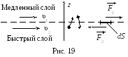
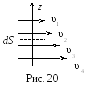
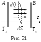

**_1.Внутреннее трение_**
Явлением **_внутреннего трения_** (вязкостью) _называется возникновение сил трения между слоями жидкости или газа, движущимися друг относительно друга параллельно и с разными по величине скоростями._ Например, при ламинарном течении скорость жидкости или газа в трубе изменяется по параболическому закону: скорость максимальна в центре трубы и равна нулю у стенок.

 

Рассмотрим границу раздела двух соседних слоёв газа (жидкости), движущихся с разными скоростями (рис. 19). Более быстрый слой стремится увлечь за собой более медленный слой, действуя на него с силой $F_{1}$, направленной по течению. Более медленный слой одновременно стремится замедлить движение более быстрого слоя, действуя на него с силой $F_{2}$.

_Причиной вязкости_ является наложение двух движений: упорядоченного движения слоёв газа (жидкости) с различными скоростями и теплового движения молекул. При этом молекулы в своём тепловом движении, переходя из слоя в слой, имеют разные скорости упорядоченного движения, и происходит перенос импульса упорядоченного движения молекул (рис. 20). Ось z на рис. 20 указывает направление потока импульса.

Модуль силы внутреннего трения **_dF_**, действующей на площадку **_dS_**, лежащую на границе между слоями, определяется **формулой Ньютона**:
$$dF=η  |\frac{dv}{dz}|dS$$

**η** – коэффициент внутреннего трения (<u>динамическая вязкость</u>, или просто <u>вязкость</u>);  $\frac{dv}{dz}$ - градиент скорости (изменение скорости движения слоев на единицу длины в направлении нормали к поверхности слоя). Жидкости, подчиняющиеся уравнению, называются ньютоновскими (вода, глицерин и др.), а неподчиняющиеся – неньютоновскими (в них вязкость зависит от градиента скорости; примером такой жидкости является раствор крахмала в воде). Единицей динамической вязкости является _паскаль-секунда_ ($Па*c$). Динамическая вязкость газов при нормальных условиях имеет порядок $10^{-5}\; Па*с$.
Наряду с динамической вязкостью используется также <u>кинематическая вязкость ν</u>, определяемая как отношение динамической вязкости к плотности среды:
$$ν = \frac{η}{ρ}.$$

Учитывая второй закон Ньютона ($\frac{dP}{dt}=F$), формулу вязкости можно представить в другом виде, как поток импульса dР через площадку dS:
$$dP=-η\frac{dv}{dz}dSdt$$
Знак «минус»  обусловлен тем, что импульс передается в направлении убывания скорости (градиент скорости отрицателен).

Если известна плотность газа ρ, то из молекулярно-кине­тической теории можно найти, что _коэффициент вязкости газа_ определяется выражением
$$η=\frac{1}{3}<v>λρ$$
Расчет вязкости _для жидкости_ очень сложен, так как движение молекул в жидкости происходит за счет «перескоков» молекул из одного «оседлого» положения в другое. Динамическая вязкость достаточно хорошо описывается формулой вида $η\approx Ae^{\frac{b}{T}}$ , где **А** и **b** – эмпирические постоянные, определяемые свойствами жидкости, **Т** – температура. Динамическая вязкость жидкостей резко уменьшается с повышением температуры (а у газов увеличивается). Динамическая вязкость обычных, не очень вязких жидкостей (вода, бензин) имеет порядок $10^{-3}\; Па*с$.

**_2.Теплопроводность_**
_**Теплопроводность**_ – _процесс передачи теплоты вследствие хаотического теплового движения молекул или атомов_.

Пусть имеются пластины А и В с постоянными температурами $Т_{А}$ и $T_{B}$, причем $T_{A}$ > $Т_{B}$ (рис. 21). Молекулы газа, сталкиваясь с пластиной А, будут отражаться от нее с энергией $E=  (\frac{3}{2}) kT_{A}$. Эти молекулы будут сталкиваться с другими молекулами и передавать им избыток своей кинетической энергии, что приводит к направленному переносу энергии в форме теплоты.

_**Закон Фурье**_: количество теплоты _dQ_, которое переносится при теплопроводности за время _dt_ через площадку _dS_, расположенную перпендикулярно оси _z_, равно:
$$dQ=-χ \frac{dT}{dz}dSdt,$$
где χ – коэффициент теплопроводности; $\frac{dT}{dz}$ – градиент температуры (изменение температуры на единицу длины). Знак «минус» в формуле указывает на то, что при теплопроводности количество теплоты переносится в направлении убывания температуры (градиент отрицателен).

Из молекулярно-кинетической теории можно получить выражение _коэффициента теплопроводности для газов_:
$$χ=\frac{1}{3}<v>λρc_{V},$$
где **$c_{V}$** – удельная теплоёмкость газа при постоянном объёме.

Из сопоставления формул для коэффициентов явлений переноса следует, что они связаны следующими соотношениями:
$$η=Dρ,$$$$χ=ηc_{V}=Dρc_{V}$$
