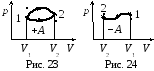
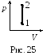
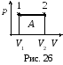
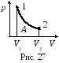

Внутренняя энергия термодинамической системы **$U$** включает в себя кинетическую энергию всех внутренних движений частиц (поступательных, вращательных, колебательных) и потенциальную энергию их взаимодействия. Для идеального газа мы пренебрегаем потенциальной энергией. Поэтому, внутренняя энергия идеального газа определяется кинетической энергией его молекул, а кинетическая энергия для данной массы газа зависит только от температуры.    

Внутренняя энергия является **функцией состояния**, т.е. <u>определяется только состоянием системы</u> (в данном случае - температурой) <u>и не зависит от вида перехода в это состояние</u>.    

Если система совершает круговой процесс (цикл), возвращаясь в начальное состояние, то полное изменение ее внутренней энергии нулю: $\oint dU=0$. Как известно, математически зто соотношение означает, что элементарное изменение **dU** является полным (точным) дифференциалом.  
  
<u>Изменить внутреннюю энергию можно двумя способами</u>: 1) совершить механическую работу; 2) сообщить системе количество теплоты. Та как раньше количество теплоты измерялось в калориях, то был установлен механический эквивалент теплоты $I = 4,19 \frac{ДЖ}{кал}$.  
  
**Первое начало термодинамики**: <u>количество теплоты, сообщённое системе‚ идёт на приращение внутренней энергии и на совершение системой работы над внешними телами:</u>  
  
$$ΔQ=ΔU+ΔA $$
Входящие в формулу величины могут быть, как положительными так и отрицательными. Если количество теплоты передается системе. она нагревается и сама совершает работу над внешними телами, то величины - положительны. Если количество теплоты отбирается от системы она остывает и внешние силы совершают над ней работу, то величины - отрицательны.  
  
Если система, например, рабочее тело в периодически действующем двигателе совершает круговой процесс (цикл), т.е. возвращается в исходное состояние, то ΔU = 0, и из первого начала термодинамики остается: ΔA = ΔQ. Отсюда следует вторая формулировка первого начала термодинамики: <u>невозможен вечный двигатель 1-го рода, т.е. такое периодически действующее устройство, которое совершало работу в большем количестве, чем полученная извне энергия.</u>

<u>Найдём работу, которую совершает газ при расширении</u>. Газ, действуя на поршень с силой **F=pS**, перемещает его на расстояние **dx** и совершает элементарную работу:
$$\delta A=Fdx=pSdx=pdV $$
Полная работа находится интегрированием: $A=\int pdv$

 

На диаграмме (**p, V**) работа равна площади фигуры, ограниченной осью **V**, прямыми **$V_{1}$** и **$V_{2}$**  и кривой р=f(V). Из рис. 23 видно, что работа (площадь под кривой) зависит от вида перехода системы из состояния 1 в состояние 2. Кроме того, работа в круговом процессе может быть не равна нулю. Поэтому работа **А** <u>не является функцией состояния</u>, а ее элементарное изменение не является полным дифференциалом. Для элементарной работы употребляют обозначения $\delta A$ или $d'A$ (а не дифференциал $dA$).  
  
Если внешние силы уменьшают объем газа (рис. 24), то при интегрировании получается "отрицательная" работа, т.к. верхний предел интегрирования $V_{2}$ меньше нижнего $V_{1}$.  
  
Применим первое начало термодинамики к изопроцессам.

_**Изохорический процесс**_ _V_ _=_ _const_ (рис. 25). Так как _V_ = _const_, то _dV_ = 0 и _ΔA_ = 0. Из уравнения первого начала термодинамики остается _ΔQ_ = _ΔU_. В изохорическом процессе всё количество теплоты, подводимое к системе, полностью идет на изменение её внутренней энергии.

_**Изобарический процесс**_ _р =_ _const_ (рис. 26). В этом процессе изменяется внутренняя энергия и совершается работа _ΔQ_ = _dU_ + _pdV_. Работа в данном случае вычисляется очень просто (это площадь прямоугольника):
$$A=p\int_{V_{1}}^{V_{2}}dV=p(V_{2}-V_{1})$$

_**Изотермический процесс**_ _T_ _=_ _const_ (рис. 27). В этом процессе _dU_ = 0, следовательно, _ΔQ_ = _ΔA_, т.е. всё подводимое количество теплоты тратится на совершение работы. Для нахождения работы выразим зависимость _p_ = _f_ (_V_) из уравнения Менделеева-Клапейрона: _p_ = _νRT_/_V_. Работа равна:
$$A=\int_{1}^{2}pdV=νRT\int_{1}^{2}\frac{dV}{V}=νRTln\frac{V_{2}}{V_{1}}$$
